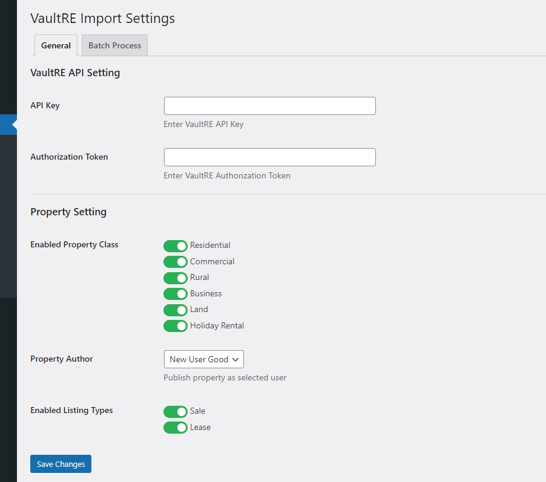

# WordPress Utilities

Simple yet powerful utility that I use mostly for my client's projects. This project was built over time so I could re-use them over multiple of my projects.

This project was actually built to have clean admin interface with ability to add tabbed settings page.



### Admin Settings Builder

---

```php
$admin = new \Sovit\Utilities\Admin_Setting();
$admin->set_page_id("my-setting-page")
        ->set_capability('manage_options')
        ->set_page_title(esc_html__('My Setting'))
        ->set_menu_title(esc_html__('My Setting'))
        ->set_setting_key("my_setting_name")
        ->set_icon('dashicons-admin-links');
```

### Available Methods

---

- `set_page_id($page_id)` - Unique Page ID (if page id is `my-setting-page` then setting page url would be `/wp-admin/admin.php?page=my-setting-page`)
- `set_capability($capability)` - Set capability (eg: `manage_options`)
- `set_menu_title($menu_title)` - Admin menu name
- `set_page_title($page_title)` - Admin setting page title
- `set_icon($icon)` - _(dashicon, icon url)_ Menu icon
- `set_setting_key($setting_key)` - Setting name key
- `set_menu_position($menu_position)` - Menu Position
- `set_menu_parent($menu_parent)` - Set menu parent _(eg: `options-general.php` if you want setting page as child of `Settings` page)_

### Available Hooks

#### `sovit/settings/{$page_id}/tabs` - Register Setting Tab

```php
add_filter("sovit/settings/{$page_id}/tabs",function($tabs){
    $tabs["my_tab"]=[
        "label"=>__("My Tab","textdomain")
    ];
    return $tabs;
});
```

Tabs also accept `render_callback` if you require custom tab content

```php
add_filter("sovit/settings/{$page_id}/tabs",function($tabs){
    $tabs["my_tab"]=[
        "label"=>__("My Tab","textdomain"),
        "render_callback"=>"my_tab_callback"
    ];
    return $tabs;
});
function my_tab_callback(){
    echo "My tab Content";
}
```

#### `sovit/settings/{$page_id}/sections` - Register Setting Section

```php
add_filter("sovit/settings/{$page_id}/tabs",function($sections){
    $sections["general"]=[
        "label"=>__("General Settings","textdomain")
    ];
    return $sections;
});
```

Sections also accept `render_callback` if you require custom section content

```php
add_filter("sovit/settings/{$page_id}/sections",function($sections){
    $sections["general_setting"]=[
        "label"=>__("General Settings","textdomain"),
        "render_callback"=>"my_section_callback"
    ];
    return $sections;
});
function my_section_callback(){
    echo "My Section Content";
}
```

#### `sovit/settings/{$page_id}/fields` - Register Setting Fields

```php
add_filter("sovit/settings/{$page_id}/fields",function($fields){
    $fields["fruit"]=[
        "label"=>__("Fruit","textdomain"),
        'section' => "general_setting",
        'tab' => "general",
        'type'    => 'select',
        "options" =>  [
            "apple" => __("Apple", "textdomain"),
        ],
        'desc' => esc_html__('Select a fruit', "textdomain"),
        // There are other options based on field types
        // see lib/Controls.php
    ];
    return $fields;
});
```

Fields also accept `render_callback` if you require custom field content

```php
add_filter("sovit/settings/{$page_id}/fields",function($sections){
    $fields["fruit"]=[
        "label"=>__("Fruit","textdomain"),
        "render_callback"=>"my_custom_field",
        // .. other field data
    ];
    return $fields;
});
function my_custom_field($field=array()){
    echo "<pre>".print_r($field,true)."</pre>"; // print field data
}
```

#### Field validation and sanitization

```php
add_filter("sovit/settings/{$page_id}/fields",function($sections){
    $fields["age"]=[
        "label"=>__("Age","textdomain"),
        "render_callback"=>"my_custom_field",
        "validate_callback"=>"my_field_validation",
        "sanitize_callback"=>"my_field_sanitization",
        // other field options
    ];
    return $fields;
});
function validate_callback($value){
    return is_int($value) && $value>5; // return true if age is integer and greater than 5
}
function sanitize_callback($value){
    return sanitize_text_field($value);
}
```

### Work In Progress

This project is work in progress but is usable as is. There are more features, but not yet documented.

### Want to contribute

If you want to contribute, create pull request.
